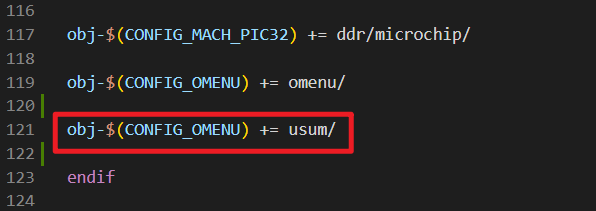
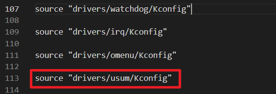
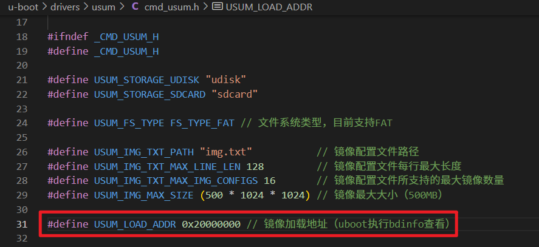

<h1 align="center">🌟 欢迎使用 USUM 🌟</h1>

<p align="center">
  
  
  
</p>

<p align="center">
  基于U-Boot的镜像升级系统，通过菜单界面选择即可完成镜像文件的独立更新
</p>

## ✨ 特性亮点

- 📦 支持 U 盘 / TF 卡加载镜像
- 🧩 支持大文件分段加载，内存占用小
- 🔧 通过 img.txt 构建下载菜单
- 🛠️ 框架清晰，平台无关性强，易于移植与扩展
- 📋 搭配日志系统

## 📸 示例演示

以下展示如何通过USUM菜单更新内核镜像。系统启动过程中，进入U-Boot命令行，执行`usum`命令调起菜单：

```shell
=> usum

========== USUM ==========
[1] udisk
[2] sdcard
[r] reboot: restart the system
[q] quit:   quit the menu
Select: 1

Enter usb device number (default 0): 0
Enter usb partition (default 1): 1

Enter destination mmc device number (default 0): 0

========== Imgs ==========
[1] uboot.img           (LBA=0x00004000)
[2] boot.img            (LBA=0x00008000)
[3] rootfs.ext2         (LBA=0x00078000)
[r] reboot: restart the system
[b] back:   return to previous menu
Select: 2

MMC write: dev # 0, block # 32768, count 74311 ... 74311 blocks written: OK

========== Imgs ==========
[1] uboot.img           (LBA=0x00004000)
[2] boot.img            (LBA=0x00008000)
[3] rootfs.ext2         (LBA=0x00078000)
[r] reboot: restart the system
[b] back:   return to previous menu
Select: r
```

至此，新的内核镜像已经烧写至板卡eMMC，重启即可。

## 🚀 快速开始

获取源码：

```shell
git clone git@github.com:Cohen0415/USUM.git
```

```shell
USUM
├── pic
├── README.md
└── u-boot
    └── drivers
        └── usum  # USUM源码
```

复制`USUM/u-boot/drivers/usum`目录到你U-Boot源码的相应位置：

```shell
cp -r USUM/u-boot/drivers/usum <your_uboot>/drivers/ 
```

修改`<your_uboot>/drivers/Makefile`，在合适位置添加如下内容，使得可以编译usum：

```shell
obj-$(CONFIG_USUM) += usum/
```



修改`<your_uboot>/drivers/Kconfig`，在合适位置添加如下内容：

```shell
source "drivers/usum/Kconfig"
```

  

至此，USUM移植结束。  

## ▶️ USUM的参数配置

进入你的uboot menuconfig。进入路径`Device Drivers`，开启USUM选项：


进入路径`USUM`：


+ `Default log level`：日志的默认等级。数字越大，等级越高。USUM会输出小于等于默认等级的所有日志。即当默认等级设置为3时，所有日志将会输出。（在初次使用时，可以先设置成3，方便查看所有调试信息）

## 💻 编译U-Boot

当你移植好USUM，且设置好相关配置后。可以开始重新编译U-Boot，并更新U-Boot到你的板卡。

## ⚙️ USUM的使用

因为每个平台的镜像更新所需要的操作细节可能不一样，此项目是基于RK3568平台实现的，目前支持单独更新uboot、内核、rootfs。如果你也是RK平台，那你应该无需做任何修改，直接可以使用。如果你是其它芯片平台，稍后我会介绍如何二次开发。

创建一个镜像配置文件，名称必须为`img.txt`，内容如下，里面描述了需要更新的镜像名和镜像在eMMC的起始地址：

```shell
[uboot.img]
LBA=0x00004000

[boot.img]
LBA=0x00008000

[rootfs.ext2]
LBA=0x00078000
```

以U盘更新为例。准备一个空U盘，文件系统格式须为fat32，将img.txt和新镜像复制进U盘即可。SD卡同理。

uboot命令行执行`usum`命令，调起菜单：

```shell
=> usum

========== USUM ==========
[1] udisk
[2] sdcard
[r] reboot: restart the system
[q] quit:   quit the menu
Select: 1
```

输入1，进入U盘更新。输入U盘的设备号（可提前在uboot命令行输入usb dev查看）和镜像文件所处在U盘的第几个分区（一般是第一个分区）：

```shell
Enter usb device number (default 0): 0
Enter usb partition (default 1): 1
```

接着输入板卡eMMC的设备号（可提前在uboot命令行输入mmc dev查看）

```shell
Enter destination mmc device number (default 0): 0
```

进入镜像选择菜单，按需更新镜像即可：

```shell
========== Imgs ==========
[1] uboot.img           (LBA=0x00004000)
[2] boot.img            (LBA=0x00008000)
[3] rootfs.ext2         (LBA=0x00078000)
[r] reboot: restart the system
[b] back:   return to previous menu
```

## 📚 二次开发

USUM源码目录结构如下：

```shell
USUM
├── cmd_usum.c          # usum命令实现
├── cmd_usum.h
├── Kconfig
├── log_usum.c          # 日志实现
├── log_usum.h
├── Makefile
└── your_img            # 你需要在此文件夹下实现你的镜像下载操作
    ├── img_boot.c
    ├── img_rootfs.c
    ├── img_uboot.c
    └── Makefile
```

较小的镜像文件可以参考img_uboot.c。较大的镜像文件可以参考img_rootfs.c，img_rootfs.c使用了分段加载和分段下载。

下面以添加resource.img的镜像下载操作为例，演示如何二次开发。因为resource.img一般存放logo，镜像比较小，可能只有几M，所以这里直接复制img_uboot.c：

```shell
cp img_uboot.c img_resource.c
```

关键在于`img_config_t`结构体的初始化：

```c
static const img_config_t img_resource = {
    .name = "resource.img",
    .addr_start = 0,
    .size = 0,
    .funs = {
        .load = load_resource,
        .check = check_resource,
        .download = download_resource,
    },
};
```

+ `name`：镜像名称，必须要与`img.txt`文件中的一致
+ `addr_start`：填0即可
+ `size`：填0即可
+ `funs`：这里有三个操作函数需要实现，分别是镜像的加载，镜像的检验，镜像的下载

调用img_config_register()注册结构体：

```c
void img_resource_register(void)
{
    img_config_register(&img_resource);
}
```

最后由cmd_usum.c中执行img_resource_register()进行注册：



## 📬 联系方式

如有问题欢迎提 issue，或私聊：

 - QQ: 1033878279

- WeChat: Cohen0415
